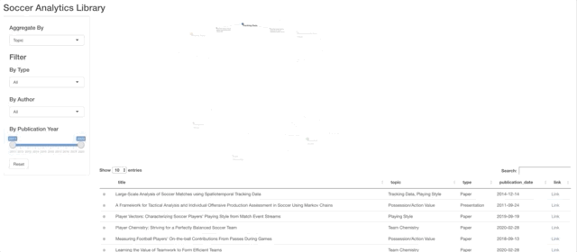
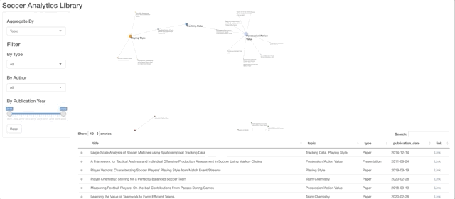
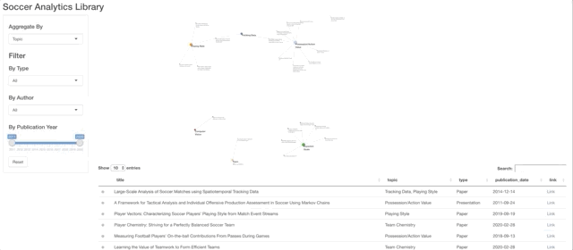
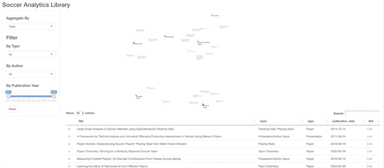

# soccer-analytics-library
A collection of soccer analytics research

This tool is an attempt to aggregate relevant research on soccer analytics across various topics like Expected Goal models, possession value, tracking date and computer vision.

I hope it will be helpful for building an overview on existing research for a certain topic, finding a paper by author/subject or identifying possible overlaps between research areas.

## Use cases

### Find all research on *xG models*

Clicking on any node filters the table below.

### Find a certain paper by name and read its abstract

The search functionality of the table makes it easy to filter by name.

### Find all papers by a certain author

The dropdown filter on the left allows us to filter the graph by author to get a quick overview of their publications and research interests.

### Filter for research published between 2011 and 2015

By filtering by publication year we can observe changing research focus over time.

## Contribute

One person alone cannot possibly know and aggregate all relevant research. If you know a piece that is missing please open an issue above with either the full information or at least the link, and I will add it. Research should be publicly available (not behind a paywall) and introduce a new concept to the community (quality over quantity).